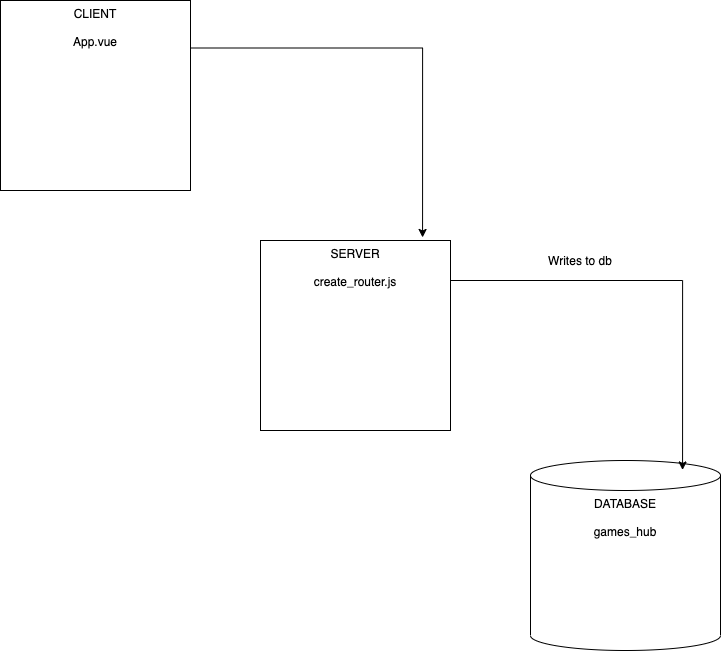

Full Stack App Preparation

Questions:

What is responsible for defining the routes of the games resource?
    
    A: The SERVER file create_router.js contains the app's routes

What do you notice about the folder structure? Whats the client responsible for? 
    
    A: The folder structure separates the various components that the client uses to generate the front-end interactivity.

Whats the server responsible for?
    
    A: The server takes information generated by the front-end and writes it to relevant section of the database.

What are the the responsibilities of server.js?
    
    A: server.js initialises and controls? the server, database and security elements of the app 

What are the responsibilities of the gamesRouter?
    
    A: gamesRouter ensures that the HTTP actions are written to the appropriate part of the database

What process does the the client (front-end) use to communicate with the server?
    
    A: 

What optional second argument does the fetch method take? And what is it used for in this application? Hint: See Using Fetch on the MDN docs
    
    A: 

Which of the games API routes does the front-end application consume (i.e. make requests to)?
    
    A: 

What are we using the MongoDB Driver for?
    
    A: 

